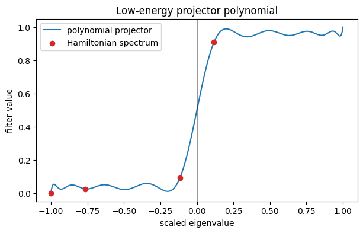
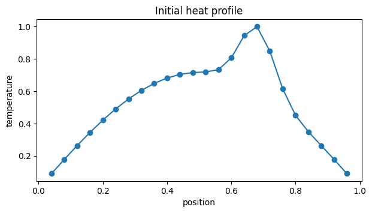
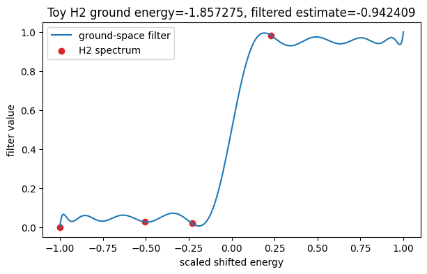
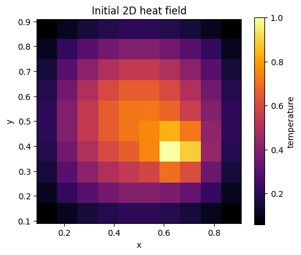
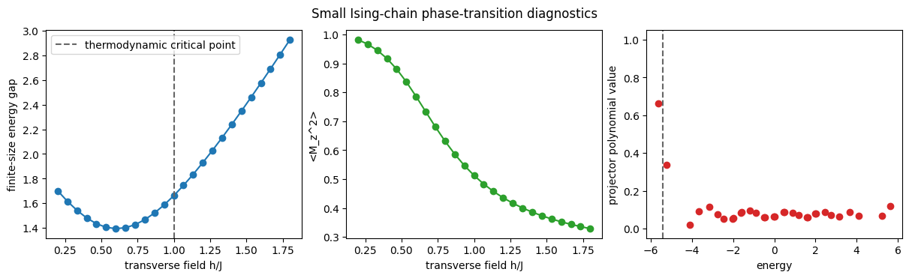
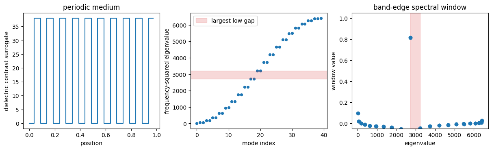

# Real-Example Results

This page is the rendered results ledger for plots, tables, and reports
generated by notebooks in `notebooks/real_examples/`.

`RESULTS.md` remains the compact root index for all result-producing workflows.
This page renders the committed real-example artefacts.

## Current Status

Real-example plot artefacts are committed for 26 of the 28 real-example
notebooks. The source notebooks remain executable workflows, and the committed
PNG files are extracted from embedded notebook outputs.

The machine-readable plot manifest is committed at
[`results/tables/real_examples_plot_manifest.csv`](../../results/tables/real_examples_plot_manifest.csv).

## Regeneration

Refresh the real-example plot artefacts with:

```bash
python scripts/extract_notebook_plots.py \
  --notebook-glob "notebooks/real_examples/*.ipynb" \
  --output-dir results/plots/real_examples
```

Refresh the manifest with:

```bash
find results/plots/real_examples -maxdepth 1 -type f -name '*.png' | sort
```

## Plot Ledger

| notebook | committed artefacts |
| --- | --- |
| `01_ground_state_filtering.ipynb` | [plot 1](../../results/plots/real_examples/01_ground_state_filtering-plot-01.png) |
| `02_tight_binding_band_filter.ipynb` | [plot 1](../../results/plots/real_examples/02_tight_binding_band_filter-plot-01.png) |
| `03_imaginary_time_filtering.ipynb` | [plot 1](../../results/plots/real_examples/03_imaginary_time_filtering-plot-01.png) |
| `04_heat_equation_pde.ipynb` | [plot 1](../../results/plots/real_examples/04_heat_equation_pde-plot-01.png), [plot 2](../../results/plots/real_examples/04_heat_equation_pde-plot-02.png) |
| `05_poisson_equation_pde.ipynb` | [plot 1](../../results/plots/real_examples/05_poisson_equation_pde-plot-01.png) |
| `06_hamiltonian_simulation_schrodinger_dynamics.ipynb` | [plot 1](../../results/plots/real_examples/06_hamiltonian_simulation_schrodinger_dynamics-plot-01.png) |
| `07_quantum_chemistry_h2_toy_solver.ipynb` | [plot 1](../../results/plots/real_examples/07_quantum_chemistry_h2_toy_solver-plot-01.png) |
| `08_greens_function_response.ipynb` | [plot 1](../../results/plots/real_examples/08_greens_function_response-plot-01.png) |
| `09_spectral_density_estimation.ipynb` | [plot 1](../../results/plots/real_examples/09_spectral_density_estimation-plot-01.png) |
| `10_gibbs_state_thermal_weights.ipynb` | [plot 1](../../results/plots/real_examples/10_gibbs_state_thermal_weights-plot-01.png) |
| `11_transport_physics_landauer_chain.ipynb` | [plot 1](../../results/plots/real_examples/11_transport_physics_landauer_chain-plot-01.png) |
| `12_tensor_network_hybrid_filtering.ipynb` | [plot 1](../../results/plots/real_examples/12_tensor_network_hybrid_filtering-plot-01.png) |
| `13_heat_equation_2d_pde.ipynb` | [plot 1](../../results/plots/real_examples/13_heat_equation_2d_pde-plot-01.png), [plot 2](../../results/plots/real_examples/13_heat_equation_2d_pde-plot-02.png), [plot 3](../../results/plots/real_examples/13_heat_equation_2d_pde-plot-03.png) |
| `14_advection_diffusion_pde.ipynb` | [plot 1](../../results/plots/real_examples/14_advection_diffusion_pde-plot-01.png) |
| `15_wave_equation_dynamics.ipynb` | [plot 1](../../results/plots/real_examples/15_wave_equation_dynamics-plot-01.png) |
| `16_helmholtz_equation_pde.ipynb` | [plot 1](../../results/plots/real_examples/16_helmholtz_equation_pde-plot-01.png) |
| `17_quantum_walk_search_toy.ipynb` | [plot 1](../../results/plots/real_examples/17_quantum_walk_search_toy-plot-01.png) |
| `18_ssh_chain_edge_state_filtering.ipynb` | [plot 1](../../results/plots/real_examples/18_ssh_chain_edge_state_filtering-plot-01.png) |
| `19_anderson_localization.ipynb` | [plot 1](../../results/plots/real_examples/19_anderson_localization-plot-01.png) |
| `20_schrodinger_bound_states.ipynb` | [plot 1](../../results/plots/real_examples/20_schrodinger_bound_states-plot-01.png) |
| `21_quantum_harmonic_oscillator_grid.ipynb` | [plot 1](../../results/plots/real_examples/21_quantum_harmonic_oscillator_grid-plot-01.png) |
| `22_electrostatic_green_function_poisson.ipynb` | [plot 1](../../results/plots/real_examples/22_electrostatic_green_function_poisson-plot-01.png) |
| `23_coupled_oscillator_normal_modes.ipynb` | [plot 1](../../results/plots/real_examples/23_coupled_oscillator_normal_modes-plot-01.png) |
| `24_ising_phase_transition_filtering.ipynb` | [plot 1](../../results/plots/real_examples/24_ising_phase_transition_filtering-plot-01.png) |
| `25_diffusion_heat_treatment_slab.ipynb` | no embedded PNG output committed |
| `26_graphene_nanoribbon_density_of_states.ipynb` | no embedded PNG output committed |
| `27_fermi_dirac_electronic_occupations.ipynb` | [plot 1](../../results/plots/real_examples/27_fermi_dirac_electronic_occupations-plot-01.png) |
| `28_photonic_crystal_band_gap_filtering.ipynb` | [plot 1](../../results/plots/real_examples/28_photonic_crystal_band_gap_filtering-plot-01.png), [plot 2](../../results/plots/real_examples/28_photonic_crystal_band_gap_filtering-plot-02.png) |

## Gallery

<a href="../../results/plots/real_examples/01_ground_state_filtering-plot-01.png"></a>
<a href="../../results/plots/real_examples/04_heat_equation_pde-plot-01.png"></a>
<a href="../../results/plots/real_examples/07_quantum_chemistry_h2_toy_solver-plot-01.png"></a>
<a href="../../results/plots/real_examples/13_heat_equation_2d_pde-plot-01.png"></a>
<a href="../../results/plots/real_examples/24_ising_phase_transition_filtering-plot-01.png"></a>
<a href="../../results/plots/real_examples/28_photonic_crystal_band_gap_filtering-plot-01.png"></a>
