# Tutorial Result Plot Gallery

These PNG files are extracted from the embedded outputs in the introductory
notebooks so the notebook figures are visible outside Jupyter.

Regenerate them after updating notebook outputs with:

```bash
python scripts/extract_notebook_plots.py
```

## Tutorial Notebook Plots

### `01_QSVT_Scalar_and_Diagonal_Matrix.ipynb`

<a href="../../results/plots/notebooks/01_QSVT_Scalar_and_Diagonal_Matrix-plot-01.png">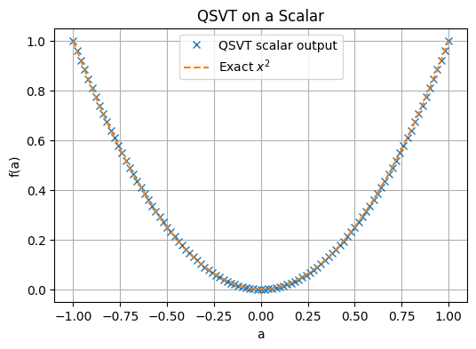</a>
<a href="../../results/plots/notebooks/01_QSVT_Scalar_and_Diagonal_Matrix-plot-02.png">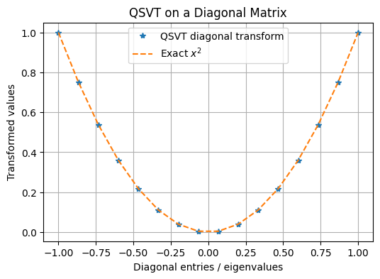</a>

### `02_QSVT_Singular_Value_Filter.ipynb`

<a href="../../results/plots/notebooks/02_QSVT_Singular_Value_Filter-plot-01.png">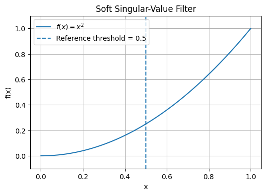</a>
<a href="../../results/plots/notebooks/02_QSVT_Singular_Value_Filter-plot-02.png">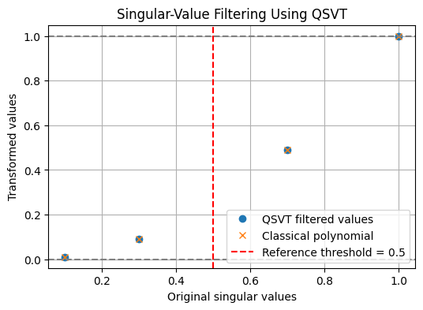</a>

### `03_QSP_Polynomial_Demo.ipynb`

<a href="../../results/plots/notebooks/03_QSP_Polynomial_Demo-plot-01.png">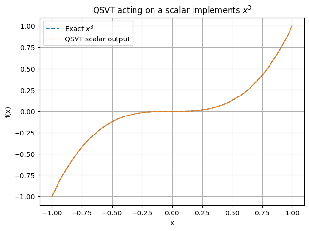</a>
<a href="../../results/plots/notebooks/03_QSP_Polynomial_Demo-plot-02.png">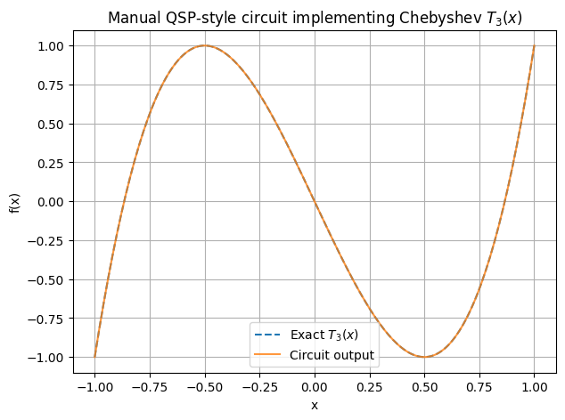</a>

### `04_QSVT_Linear_Solver_2x2.ipynb`

<a href="../../results/plots/notebooks/04_QSVT_Linear_Solver_2x2-plot-01.png">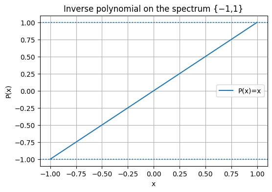</a>
<a href="../../results/plots/notebooks/04_QSVT_Linear_Solver_2x2-plot-02.png">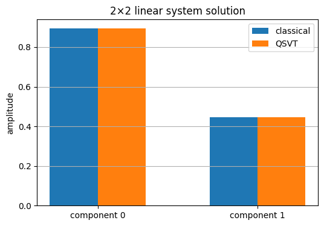</a>

### `05_QSVT_Linear_Solver_4x4.ipynb`

The extracted files currently use the historical `04_QSVT_Linear_Solver_4x4`
prefix.

<a href="../../results/plots/notebooks/04_QSVT_Linear_Solver_4x4-plot-01.png">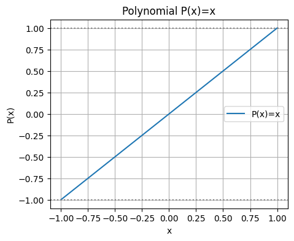</a>
<a href="../../results/plots/notebooks/04_QSVT_Linear_Solver_4x4-plot-02.png">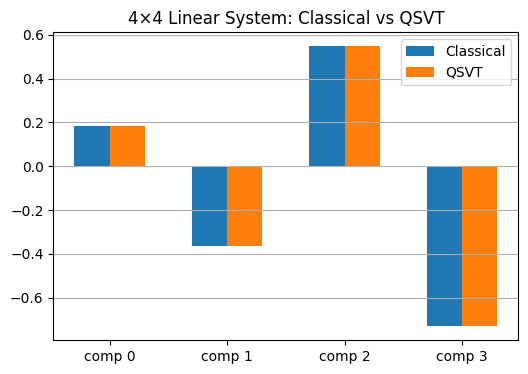</a>

### `06_QSVT_Linear_Solver_Approximate.ipynb`

The extracted files currently use the historical `05_QSVT_Linear_Solver_Approximate`
prefix.

<a href="../../results/plots/notebooks/05_QSVT_Linear_Solver_Approximate-plot-01.png">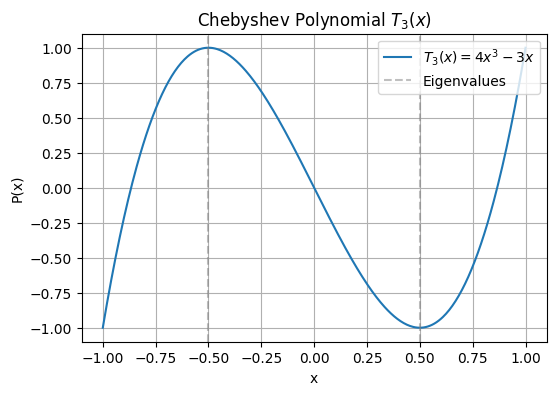</a>
<a href="../../results/plots/notebooks/05_QSVT_Linear_Solver_Approximate-plot-02.png">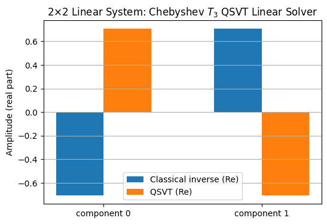</a>

### `07_QSVT_Polynomial_Design_and_Approximation.ipynb`

The extracted files currently use the historical `06_QSVT_Polynomial_Design_and_Approximation`
prefix.

<a href="../../results/plots/notebooks/06_QSVT_Polynomial_Design_and_Approximation-plot-01.png">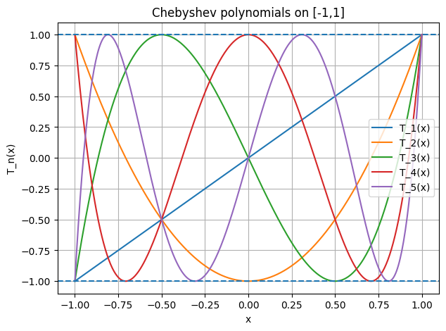</a>
<a href="../../results/plots/notebooks/06_QSVT_Polynomial_Design_and_Approximation-plot-02.png">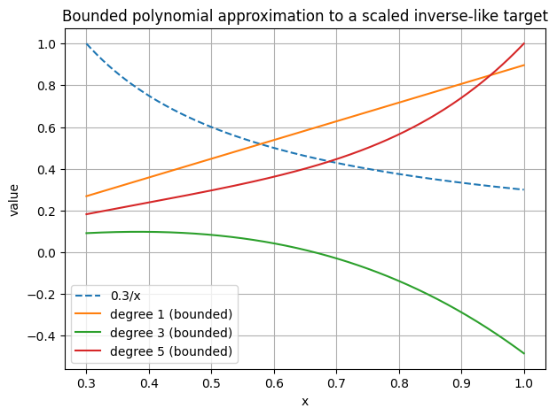</a>
<a href="../../results/plots/notebooks/06_QSVT_Polynomial_Design_and_Approximation-plot-03.png">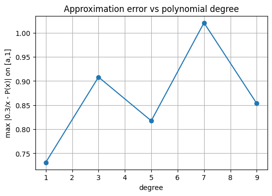</a>

### `08_QSVT_Matrix_Functions_Powers_and_Roots.ipynb`

The extracted files currently use the historical `07_QSVT_Matrix_Functions_Powers_and_Roots`
prefix.

<a href="../../results/plots/notebooks/07_QSVT_Matrix_Functions_Powers_and_Roots-plot-01.png">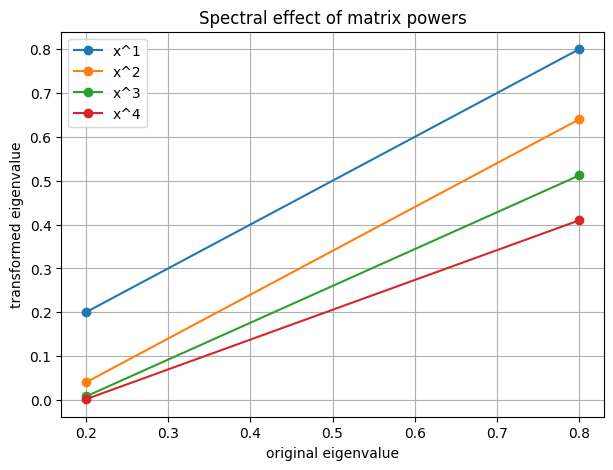</a>
<a href="../../results/plots/notebooks/07_QSVT_Matrix_Functions_Powers_and_Roots-plot-02.png">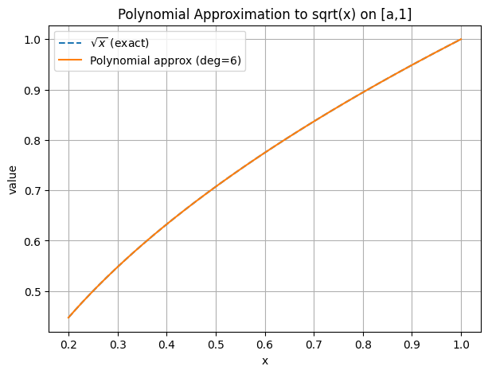</a>
<a href="../../results/plots/notebooks/07_QSVT_Matrix_Functions_Powers_and_Roots-plot-03.png">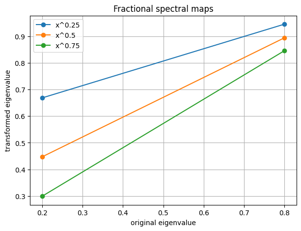</a>

### `09_QSVT_Sign_Function_and_Projectors.ipynb`

The extracted files currently use the historical `08_QSVT_Sign_Function_and_Projectors`
prefix.

<a href="../../results/plots/notebooks/08_QSVT_Sign_Function_and_Projectors-plot-01.png">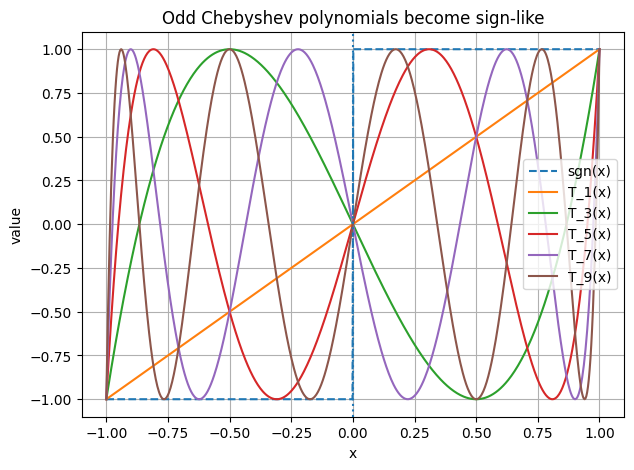</a>
<a href="../../results/plots/notebooks/08_QSVT_Sign_Function_and_Projectors-plot-02.png">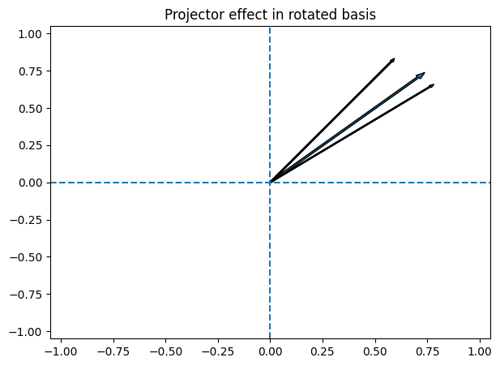</a>

### `10_QSVT_Design_and_Templates.ipynb`

The extracted files currently use the historical `09_QSVT_Design_and_Templates`
prefix.

<a href="../../results/plots/notebooks/09_QSVT_Design_and_Templates-plot-01.png">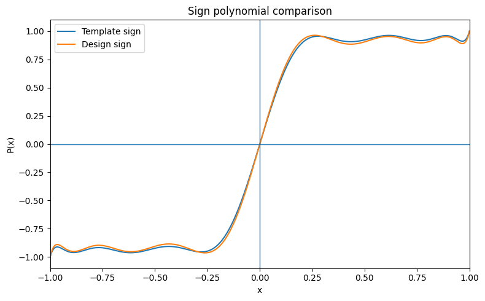</a>
<a href="../../results/plots/notebooks/09_QSVT_Design_and_Templates-plot-02.png">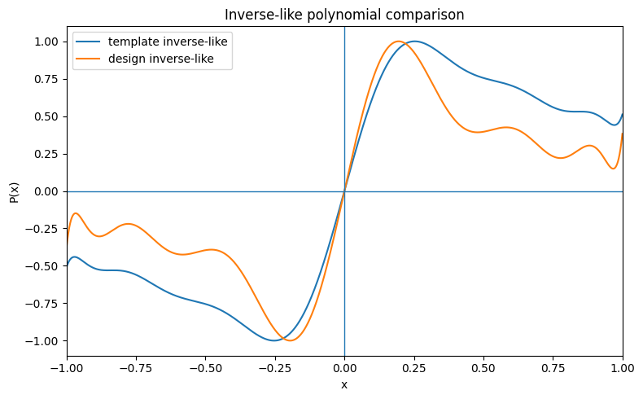</a>
<a href="../../results/plots/notebooks/09_QSVT_Design_and_Templates-plot-03.png">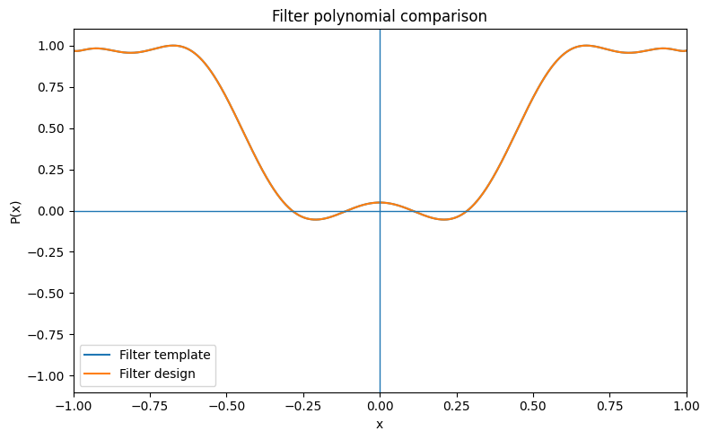</a>
<a href="../../results/plots/notebooks/09_QSVT_Design_and_Templates-plot-04.png">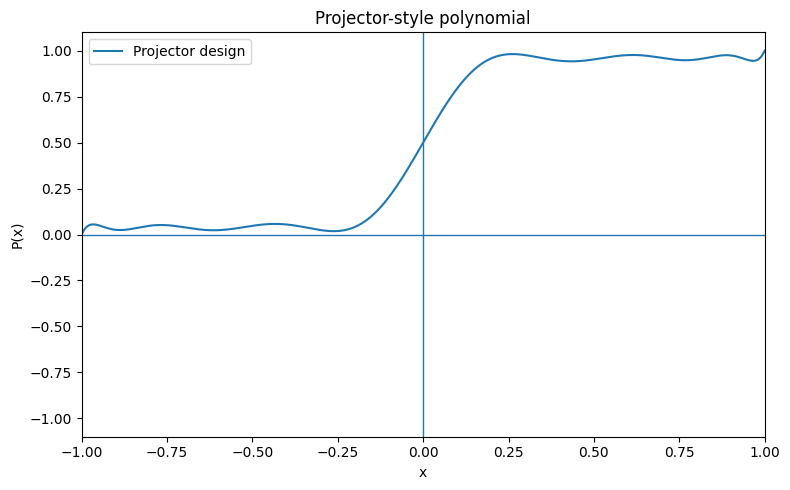</a>
<a href="../../results/plots/notebooks/09_QSVT_Design_and_Templates-plot-05.png">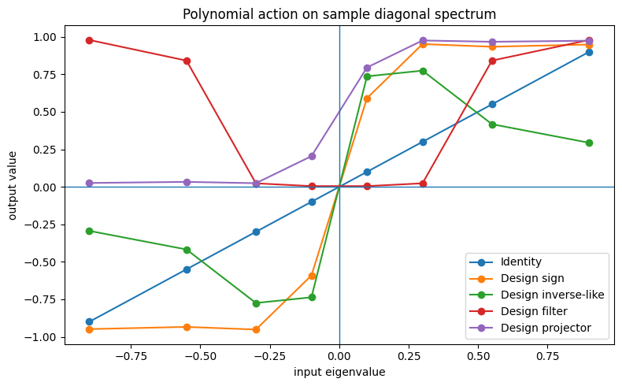</a>
